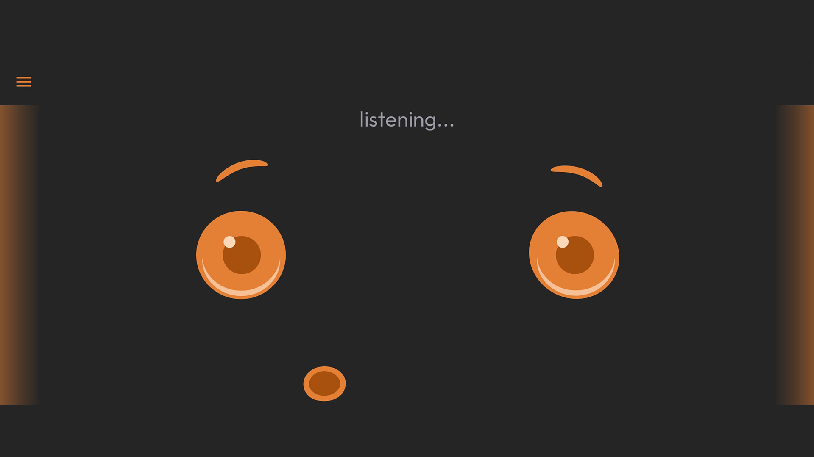
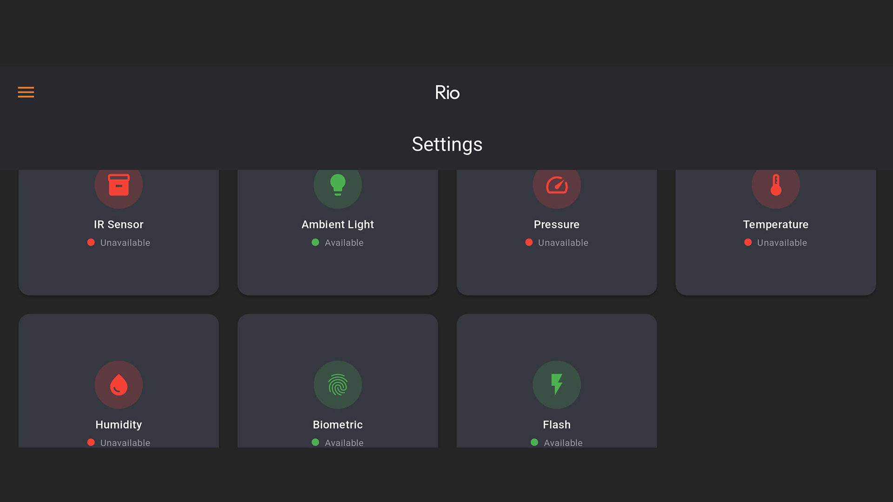

<div align="center">


# 🤖 ROS 2 Humble on Android (Termux)


*Run ROS 2 Humble, Micro-ROS ,Groq Cloud LLM and RIO ROS2 packages on your Android device using Termux and ROS2Sense Mobile App for sensor hub*
</div>

---

## 📋 Prerequisites

- 📱 Android device running Android 7.0 or higher
- 💾 At least 16GB of free storage space
- 🌐 Internet connection
- 📱 Termux app (latest version)
- 📱 ROS2Sense Mobile App (latest version)

---

## 🚀 Installation Steps

### 📥 1. Install Termux App

1. Download the latest Termux app from the official releases:
   <details>
   <summary>Download Links</summary>

   - For Android 7+ devices: [termux-app_v0.119.0-beta.2+apt-android-7-github-debug_universal.apk](https://github.com/termux/termux-app/releases/download/v0.119.0-beta.2/termux-app_v0.119.0-beta.2+apt-android-7-github-debug_universal.apk)
   - For Android 5/6 devices: [termux-app_v0.119.0-beta.2+apt-android-5-github-debug_universal.apk](https://github.com/termux/termux-app/releases/download/v0.119.0-beta.2/termux-app_v0.119.0-beta.2+apt-android-5-github-debug_universal.apk)
   </details>

2. Install the downloaded APK on your device
3. Open Termux app and grant necessary permissions

### ⚙️ 2. Installation Process (Two-Step)

<details>
<summary><b>Step 1: Setup Ubuntu (in Termux)</b></summary>

Update Termux and get required packages
```bash
termux-change-repo -y && pkg update -y && pkg upgrade -y && pkg install wget -y
```
Download and run Ubuntu setup script
```bash
wget https://raw.githubusercontent.com/botforge-robotics/ros2_android/refs/heads/humble/setup_ubuntu.sh && chmod +x setup_ubuntu.sh && ./setup_ubuntu.sh
```
</details>

<details>
<summary><b>Step 2: Install ROS 2 and RIO (in Ubuntu)</b></summary>

After Ubuntu is installed:
1. Start Ubuntu environment in Termux(if not already started):
```bash
./start-ubuntu22.sh
```
2. Update and install required packages
```bash
apt update && apt upgrade -y && apt install wget -y
```
3. Download and run ROS 2 setup script
```bash
wget https://raw.githubusercontent.com/botforge-robotics/ros2_android/refs/heads/humble/setup_ros2.sh && chmod +x setup_ros2.sh && ./setup_ros2.sh
```
</details>

The installation process will:
- 📦 Install Ubuntu 22.04 using Andronix
- 🔧 Set up ROS 2 Humble
- 🤖 Install Micro-ROS
- 🚀 Set up RIO ROS2 packages
- ⚙️ Configure all environments
> 📝 **Note(CycloneDDS):** By default `ros2_setup.sh` installs and configures CycloneDDS (rmw_cyclonedds_cpp) as the ROS 2 middleware for better performance, as it is lightweight and efficient for mobile.

> 📝 **Note(Domain ID):** For remote communication, ROS_DOMAIN_ID is set to 156 by default in `ros2_setup.sh`.You can change it to any number between 0-232 in `ros2_setup.sh` line 144 and restart termux.


## 📝 Post-Installation

After successful installation:
1. 🔄 Restart your Termux app
2. 🔧 Your ROS 2 environment will be automatically sourced 
3. ✅ Run `ros2 --help` to verify the installation


---


## 📱 Using ROS2Sense Mobile App

ROS2Sense transforms your smartphone into a powerful ROS 2 sensor hub, providing:

### Available Sensors 🎯
- 📡 Accelerometer – Detect motion and orientation
- 🔄 Gyroscope – Measure angular velocity
- 🧭 Magnetometer – Get compass direction
- 📍 GPS – Track precise location for navigation
- 📸 Cameras – Use mobile cameras for vision-based applications
- 🌫 IR Sensor – Use infrared commands to control home appliances like ACs and TVs (Comming Soon)
- 💡 Ambient Light Sensor – Detect environment light
- 🔊 Microphone & Speaker – Enable voice interactions & Text to speech
- 🆔 Fingerprint/Face ID – Biometric security and authentication for robots
- 📲 Display Output – Use your mobile screen for animated robotic expressions
- Inbuilt Madgwick Filter for IMU data fusion, Hotword Detection.

### Download ROS2Sense from [Google Play Store](https://play.google.com/store/apps/details?id=com.botforge.rio)
<div style="display: flex; flex-wrap: wrap; gap: 15px; justify-content: center; margin: 25px 0; max-width: 800px; margin-left: auto; margin-right: auto;">
    <div style="flex: 0 0 calc(50% - 15px); box-sizing: border-box;">
        
    </div>
    <div style="flex: 0 0 calc(50% - 15px); box-sizing: border-box;">
        
    </div>
    <div style="flex: 0 0 calc(50% - 15px); box-sizing: border-box;">
        
    </div>
</div>

### Groq API Setup for Voice Features

To use voice interactive features in ROS2Sense Mobile App, you'll need a Groq API key:

1. Create an account at [Groq API Console](https://console.groq.com/login)
2. Get your API key
3. Set the API key as an environment variable:
   ```bash
   export GROQ_API_KEY=<your_groq_api_key>
   ```

4. Permanently add the API key to the environment variable GROQ_API_KEY in the ~/.bashrc file
   ```bash
   echo "export GROQ_API_KEY=<your_groq_api_key>" >> ~/.bashrc
   ```

---

## 🚀 Usage

### Launch Options

There are three ways to launch RIO nodes:

1. **Mobile Nodes Launch**
   - Launches smartphone-related functionality
   - Includes LLM, WebRTC, and WebSocket nodes

2. **PCB Nodes Launch** 
   - Launches hardware-related components
   - Includes Micro-ROS agent and sensor nodes

3. **Real Robot Launch**
   - Combines both mobile and PCB functionality
   - Full robot system deployment

#### 1.1 Mobile Nodes Launch
The mobile nodes launch file (`mobile_nodes.launch.py`) starts components related to the smartphone functionality:

```bash
# Launch mobile-related nodes
ros2 launch rio_bringup mobile_nodes.launch.py llm_backend:=groq
```

This launch file includes:
- **Ollama LLM Node**: Local LLM for robot voice interactions
- **Groq LLM Node**: Cloud LLM for robot voice interactions
- **WebRTC Node**: Video streaming server (port 8080)
- **Rosbridge WebSocket**: Enables ROS2-to-WebSocket communication

**Mobile Node Launch Parameters**:
| Parameter | Description | Default Value | Options |
|-----------|-------------|---------------|---------|
| `llm_backend` | LLM backend | `ollama` | `ollama`, `groq` |

> 📝 **Note:** Use `llm_backend:=groq` to use groq cloud LLM for voice interactions as ollama is resource intensive.

> 📝 **Note:** If you encounter issues [getifaddrs(): permission denied](#getifaddrs-permission-denied)  refer to troubleshooting section for more details.

#### 1.2 PCB Nodes Launch
The PCB nodes launch file (`pcb_nodes.launch.py`) manages hardware-related components:

```bash
# Launch PCB-related nodes
ros2 launch rio_bringup pcb_nodes.launch.py agent_port:=8888
```

**PCB Launch Parameters**:
| Parameter | Description | Default Value |
|-----------|-------------|---------------|
| `agent_port` | Micro-ROS agent UDP port | `8888` |

This launch file includes:
- **Micro-ROS Agent**: Handles communication with ESP32
- **Odometry TF Broadcaster**: Publishes transform data
- **LIDAR UDP Node**: Manages LIDAR sensor data

#### 1.3 Real Robot (Mobile+PCB) Launch

```bash
# Launch real robot nodes
ros2 launch rio_bringup rio_real_robot.launch.py \
  use_sim_time:=false \
  agent_port:=8888
```

**Real Robot Parameters**:
| Parameter | Description | Default Value | Options |
|-----------|-------------|---------------|---------|
| `use_sim_time` | Use simulation clock (must be false for real hardware) | `false` | `true`/`false` |
| `agent_port` | Micro-ROS agent UDP port | `8888` | Any available port number |

> 📝 **Note:** Make sure to set up the domain and network configuration before launching any nodes to ensure proper communication between components.

#### 2. In ROS2Sense App 📱
- Enter `0.0.0.0` as ROS2 Bridge IP on connecting screen (since ROS2 is running on same device) only if `mobile_nodes.launch.py` or `rio_real_robot.launch.py` is launched.

#### 3. On Desktop PC with ROS2 Humble installed 💻

```bash
export ROS_DOMAIN_ID=156 
export ROS_LOCALHOST_ONLY=0
```
> 📝 **Note:** ROS_DOMAIN_ID is set to 156 by default in `setup_ros2.sh` in termux.you can change it to any number between 0-232 in `setup_ros2.sh` line 144.

or export to .bashrc for permanent use
```bash
echo "export ROS_DOMAIN_ID=156" >> ~/.bashrc
echo "export ROS_LOCALHOST_ONLY=0" >> ~/.bashrc
```

check topics published by mobile nodes
```bash
ros2 topic list
```


---

### 🌐 ROS Domain Setup for Remote Communication

To enable communication between your mobile device (running ROS 2 in Termux/Ubuntu) and a remote PC running ROS 2:

1. **On your remote PC** 💻
   ```bash
   export ROS_DOMAIN_ID=156 
   export ROS_LOCALHOST_ONLY=0
   ```
 
   or export to .bashrc for permanent use
   ```bash
   echo "export ROS_DOMAIN_ID=156" >> ~/.bashrc
   echo "export ROS_LOCALHOST_ONLY=0" >> ~/.bashrc
   ```

> 🔒 **Note:** ROS_DOMAIN_ID is set to 156 by default in `termux`.You can change it to any number between 0-232 in `setup_ros2.sh` line 144 and restart termux.


---

### 🔑 SSH Login (Termux)

To remotely access your Termux environment via SSH from another device (like your computer), follow these steps:

1. **Activate SSH in Termux** 
   ```bash
   sshd
   ```
2. **Get your Termux username** 👤
   ```bash
   whoami
   ```
   This will display your Termux username that you'll need for SSH login.

3. **Find your device's IP address** 📍
   ```bash
   ifconfig
   ```
   Look for the `wlan0` section and find the `inet` address - this is your device's IP address on the WiFi network.
   For example: `inet 192.168.1.100`

4. **Connect via SSH from another device** 🔌
   ```bash
   ssh <username>@<ip_address> -p 8022
   ```
   Example: `ssh u0_a572@192.168.1.100 -p 8022`
   
   > **Note:** Port 8022 is Termux's default SSH port, different from the standard port 22.

5. **Enter your password** 🔐
   - You'll be prompted for the password you set during the Ubuntu installation
   - Type your password (it won't be visible as you type)
   - Press Enter to submit

6. **Success!** ✨
   You should now see the Termux prompt, indicating a successful SSH connection.

7. **Start Ubuntu** 🚀
   ```bash
   ./start-ubuntu22.sh
   ```
   This launches your Ubuntu environment within the SSH session.

---
## 🔗 Related Repositories

- [RIO Hardware](https://github.com/botforge-robotics/rio_hardware) - Hardware design files, BOM and assembly instructions
- [RIO Firmware](https://github.com/botforge-robotics/rio_firmware) - Micro-ROS firmware for the RIO controller board
- [RIO ROS2](https://github.com/botforge-robotics/rio_ros2) - ROS2 packages for navigation, control, and sensor integration

---
## ❗ Troubleshooting

If you encounter any issues:

1. **getifaddrs(): permission denied** 🔄
   we have developed a patch to fix the getifaddrs error.
   Download the patch:
   ```bash
   wget https://raw.githubusercontent.com/botforge-robotics/ros2_android/refs/heads/humble/patch_getifaddrs.c
   ```
   
   Compile the patch:
   ```bash
   gcc -shared -fPIC -o patch_getifaddrs.so patch_getifaddrs.c -ldl
   ```
   
   Apply the patch temporarily:
   ```bash
   export LD_PRELOAD=$PWD/patch_getifaddrs.so
   ```
   
   Or apply permanently by adding to .bashrc:
   ```bash
   echo "export LD_PRELOAD=$PWD/patch_getifaddrs.so" >> ~/.bashrc
   ```
   
   Test the patch:
   ```bash
   wget https://raw.githubusercontent.com/botforge-robotics/ros2_android/refs/heads/humble/test_getifaddrs.c
   ```
   ```bash
   gcc -o test_getifaddrs test_getifaddrs.c
   ```
   ```bash
   ./test_getifaddrs
   ```
   Output:
   ```bash
   Network interfaces detected:
   Interface: wlan0
      IPv4 Address: 192.168.0.195
   Interface: lo
      IPv4 Address: 127.0.0.1
   Interface: rmnet_data3
      IPv4 Address: 100.65.187.41
   ```
2. 🌐 Check your internet connection

3. 🔄 If the first script fails:
   - Try running `setup_ubuntu.sh` again

4. 🔧 If the second script fails:
   - Make sure you're in the Ubuntu environment
   - Try running `setup_ros2.sh` again

5. 📝 Check the error messages in the script output

6. **Permission Issues** 🔒
   If you encounter permission errors:
   ```bash
   chmod +x setup_ubuntu.sh
   chmod +x setup_ros2.sh
   ```


## 📌 Notes

- ⏳ The installation process may take some time depending on your device and internet connection
- 🔋 Make sure your device is plugged into a power source during installation

## 🤝 Contributing

Feel free to submit issues and enhancement requests!

## 📄 License

This project is licensed under the MIT License - see the [LICENSE](LICENSE) file for details.

---

<div align="center">
<b>Made with ❤️ by BotForge Robotics</b>
</div>